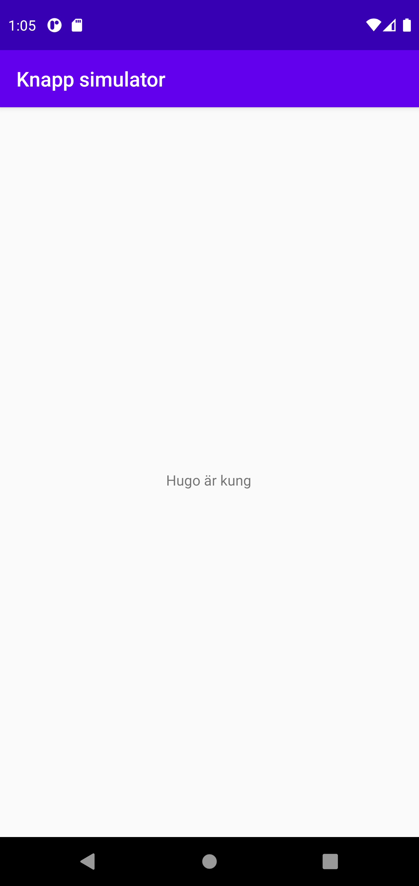

# Rapport

**Skriv din rapport här!**

Jag skapade en till activity med en tillhörande layout fil. I layout filen för MainActivity ligger en knapp och i layout filen för SecondActivity ligger det en textview. Jag har gjort en sträng som skickas från MainActivity till SecondActivity när man klickar på knappen. När strängen väl är i den andra activity så skrivs den ut i textview.

```
//MainActivity 

    Button btn;
    String message = "Hugo är kung";
        
        btn = findViewById(R.id.button);

        btn.setOnClickListener(new View.OnClickListener() {
            @Override
            public void onClick(View v) {
                Intent intent = new Intent(MainActivity.this, SecondActivity.class);
                intent.putExtra("String", message);
                startActivity(intent);
            }
        });

//SecondActivity 

        TextView text;
        text = findViewById(R.id.textView);
        text.setText(getIntent().getStringExtra("String"));
```





